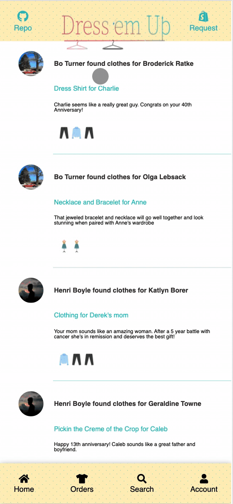
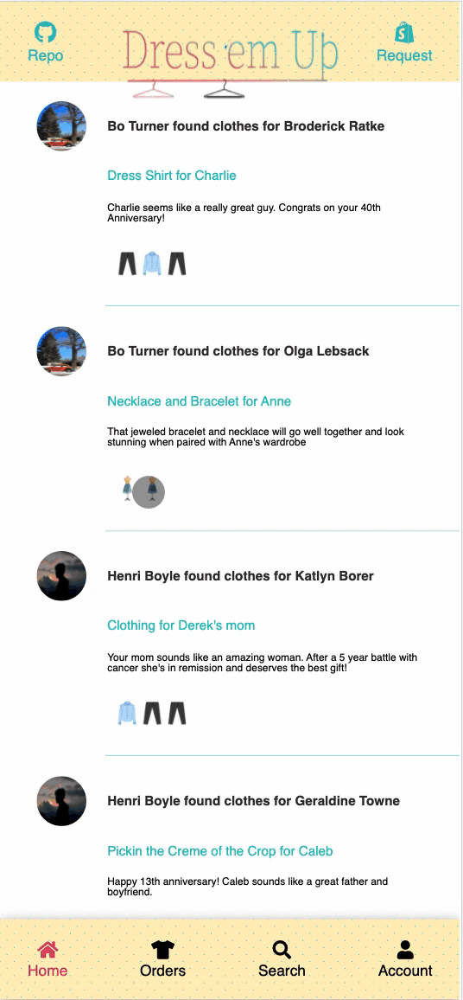
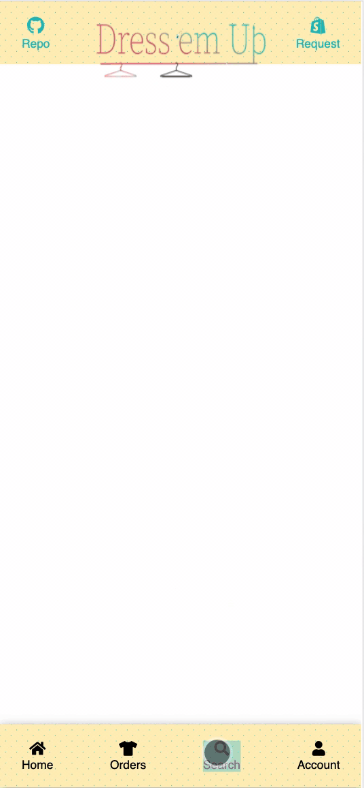
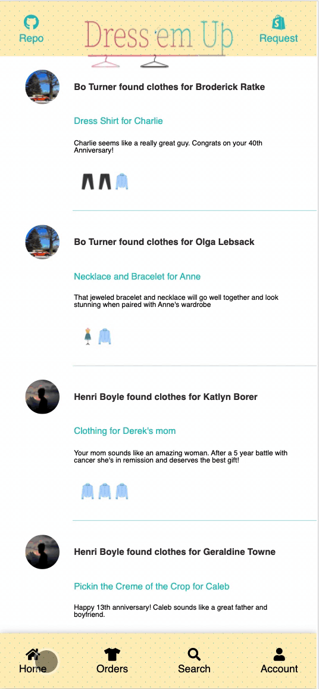

# [Dress 'em Up](https://dress-em-up.herokuapp.com/)


Check out Dress 'em Up at the live link below:

https://dress-em-up.herokuapp.com/

> Welcome to Dress 'em Up

An app designed to connect personal shoppers/designers with gift-givers everywhere, Dress-em-up helps you to find the perfect gift for yourself, your significant other, or your loves ones.  Based on a gig economy design the app provides users the opportunity to upload images of their loved ones or themselves in their favorite clothes, send a request to a designer, and receive recommendations in the form of hyperlinks to the perfect clothes.  Each designer will in turn create a response with hyperlinks and receive cash compensation for fulfilling the request.  

Users are designated as a user or designer and information is stored online in AWS's S3 online service.

As a logged-in user, you will have access to:

* Homepage Feed (gives insight into recent recommendations by others that are signed into the app )
* Orders (connection to current requests along with past recommendations)
* Likes (created using dresses with 5 dresses for excellent and 1 dress for poor)
* Search (Search for popular designers or look at your own past designers)

## Features

### Splash Page

The Splash Page will feature a carousel that gives users the information into how the app works if they do not already have a login saved.  Includes a login and signup modal as shown below.  Designers can also request to become a future designer by uploading their resume and then can preview the site experience similar to a users.  If they already have an account they are taken to the main home page:


### Home Page

The Home Page will render a list of recent recommendations made by designers and users who are apart of the community.  The recommendations are rendered by most recent and allow users to click on the links that were recommended to other users to see if a designer has done a good job with other users:



The links are shown below and are rendered on each recommendation form.  Depending on what type of request the user made (dress, shirt, pants, etc.) the image rendered uses a randmoization algorhythm to render an image to match their specific type of request.



### Search

The searchbar was an interesting challenge as I tried to implement multi-term searches which successfully queries the database with multiple terms.  Rendering the ratings along with each designer was also challenging as I had to reshape the POJO on the front end to be refenced by the designer id, so the frontend could render more quickly by not having to perform an O of N function, but merely a simple match.

* Use possible multiple parameters to search for a designer by first name, last name, or email

    On the frontend the React State is used to store info related to the search in an array and is eventually dispatched to the store with these requests put into a url query.
    
    ```js
    <div className='search-container pattern-cross-dots-lg'>
      <div className="search-bar-container">
          <h1 className='search-bar-title'>Search for a Designer</h1>
        <div className="search-bar">
          <input
          onChange={(e) => setKeywordSearch(e.target.value)}
          className="search-bar-keyword"
          placeholder="Sally Jameson"
            name="keywordSearch" />
          <button onClick={activateSearch} className="search-button">
            <i className="fas fa-search search-magnify" />
          </button>
        </div>
        <div className='search-results-title pattern-cross-dots-lg'>
          <h2>Results</h2>
        </div>
        {designersSearch ?
            Object.values(designersSearch).map((person, idx) => {
      return (
        <div key={idx} className='search-my-designers-individual'>
        <NavLink className='search-my-designers-navlinks' to={`/users/${person.id}`}>
          <div className='search-my-designers-header'>
          
            <div className='search-my-designers-name-rating'>
              <h1 className='search-my-designers-name'>{person.firstName} {person.lastName}</h1>
                <div className={`did${designerRatings[`${person.id}`].designerId} search-my-designers-ratings-container`}>
              {renderRatings2(designerRatings[`${person.id}`].avgRating) }
              </div>
            </div>
          </div>
        </NavLink>
      </div>
      )
    })
          :
          null
      }
    ```

* On the backend use the search options to query the database using a complex sequelize query.  This was complicated as the api route took in multiple calls from the store and had to sort for the correct type of query.



    ```js
      if (!req.query['q0']) {
    const oldDesigners = await User.findAll({
      where: {
        userType: false,
      }
    })
    designers = {}
    for (let i = 0; i < oldDesigners.length; i++) {
      designers[oldDesigners[i].id] = oldDesigners[i]
    } 
  } 
  else if (!req.query['q1']) {
    console.log("FIRST CONSTRUCTION!!!!")
    let keywordSearch = req.query['q0']
    designers = await User.findAll({
      where: {
        userType: false,
        [Op.or]: [{firstName: {
          [Op.iLike]: '%'+keywordSearch+'%'
        }}, {lastName: {
          [Op.iLike]: '%'+keywordSearch+'%'
        }}, {email: {
          [Op.iLike]: '%'+keywordSearch+'%'
        }}, {username: {
          [Op.iLike]: '%'+keywordSearch+'%'
        }}]
      }
    })
  } 
  else {
    let keywordSearches = req.query;
    let queries = Object.values(keywordSearches).map((keywordSearch) => {
      return `%${keywordSearch}%`
    })
    designers = await User.findAll({
      where: {
        userType: false,
        [Op.or]: [
          {
            firstName: {
              [Op.iLike]: { [Op.any]: queries }
            }
          },
          {
            lastName: {
              [Op.iLike]: { [Op.any]: queries }
            }
          },
          {
            email: {
              [Op.iLike]: { [Op.any]: queries }
            }
          },
          {
            username: {
              [Op.iLike]: { [Op.any]: queries }
            }
          }
        ]
      }
    })
  }
    return res.json({ designers });
    )
    
    ```

### Orders

The orders page renders a list of requests and recommendations for the users past and current orders:



* Create a request in the header modal which includes image upload to the AWS S3 storage
* View your open requests and edit them
* View your past recommendations and the designers who recommended them to you.

Implementing the correct backend algorhythms to manage the creationg of a uuid tag for my images and storing them in both a local database and the cloud-based service presented a challenge as it required two api calls and careful handling of asynchronous tasks.  My redux store shown below, send a request to my own api which queries for the user requests which include the uuid tag as the name.  AWS also provides an object with a method that renders a get html that includes a token that expires after a short period of time.  This token is used to query the AWS server via axios.get and the information is attached as an image url to the requests in the redux store.  

```js
export const searchUserRequests = (id) => async (dispatch) => {
  const res = await fetch(`/api/session/${id}/requests`, {
    method: 'GET',
  })
  let newRequests = res.data.requests
  for (let i = 0; i < newRequests.length; i++) {
    const generateGetUrl = 'api/uploads/get-url';
    const options2 = {
      params: {
        Key: newRequests[i].image,
        ContentType: 'image/jpeg',
        expires: 31536000,
      }
    };
    await axios.get(generateGetUrl, options2).then(res => {
      const { data: getURL } = res;
      console.log("THIS IS THE RETURNED URL", getURL)
      if (!getURL.message) {
        newRequests[i].imageURL = getURL
        console.log("THIS IS THE CURRENTIMAGEKEY", getURL)
        return
      }
    });
  }
  dispatch(setUserRequests(res.data.requests));
  return res
}
```

Because my tables are self-referential between users and designers, all the other tables act as join tables which I could not query with sequelize.  Therefore I created a raw SQL query and retrieved designer information along with requests information by using keywords of 'JOIN' and 'WHERE'. 

```js

router.get('/:id(\\d+)/requests', requireAuth, asyncHandler(async (req, res) => {
  const userId = parseInt(req.params.id, 10)
  let oldRequests = await sequelize.query(`SELECT "Requests"."id", image, "isCompleted", "Requests".description, "apparelChoice", "Requests"."createdAt", "userId", "designerId", "Users"."firstName" AS "designerFirstName", "Users"."lastName" AS "designerLastName" FROM "Requests" JOIN "Users" ON "designerId" = "Users".id WHERE "userId"=${userId} ORDER BY "createdAt"` );
  let requests = oldRequests[0];

  console.log("THESE ARE THE REQUESTS BEING MADE!?!?!??!", requests)
    return res.json({ requests });
}))

```


## FAQ

### What is a user and designer?

A user is an individual who makes a request to find clothing for themselves or their loved ones by uploading images and filling in a simple form, and a designer received the request and sends back a recommendation of what to buy for them.

### Why Dress 'em Up?

I've seen so many people, including myself, struggle with understanding someone's style and where to shop and how to find the best gift of clothing for them.  There's a world of designers out there who understand how to do this, so why not tap into that wealth of knowledge to help us all out?

## Links

Live Link:

https://dress-em-up.herokuapp.com/

## Technologies Used
         

## Contributor

* Dale Sakamoto - DaleTsakamoto @ GitHub

